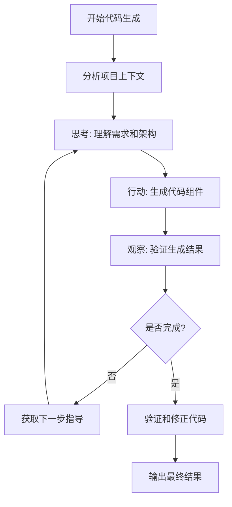

# 智能编码节点 ReAct 模式使用指南

## 概述

智能编码节点现在支持 **ReAct (Reasoning and Acting)** 模式，这是一种让大模型进行思考-行动-观察循环的高级代码生成模式。ReAct模式能够显著提升代码生成的质量和准确性。

## ReAct 模式特性

### 🧠 核心能力
- **思考分析**: 模型会先分析项目结构和需求
- **步骤规划**: 制定代码生成策略和步骤
- **逐步生成**: 按步骤生成代码组件
- **自我验证**: 观察和调整生成结果
- **迭代优化**: 多轮循环直到完成
- **工具调用**: 智能调用Java代码分析器获取项目信息

### 🛠️ 智能工具调用

ReAct模式现在支持大模型主动调用分析工具：

#### 可用工具
- **analyze_java_project**: 分析Java项目整体架构和技术栈
- **get_project_context**: 获取代码生成所需的项目上下文
- **analyze_code_patterns**: 分析项目命名模式和编码规范

#### 工具调用示例
大模型会根据需要自动调用工具：

```
**Thought**: 我需要了解这个项目的架构风格和技术栈
**Action**: 调用工具分析项目结构
**Tool Call**: analyze_java_project
**Parameters**: {"project_path": "/path/to/project", "service_name": "user-service"}
**Observation**: 项目使用Spring Boot + MyBatis Plus，采用DDD分层架构
```

### 🎯 生成组件
ReAct模式可以生成完整的企业级Java代码组件：

- **Controller**: RESTful API控制器
- **Service**: 业务逻辑服务层
- **DTO**: 请求/响应数据传输对象
- **Entity**: MyBatis Plus实体类（可选）
- **Mapper**: 数据访问层接口（可选）

### 🔧 配置选项

```python
# 默认ReAct配置
react_config = {
    'enabled': True,              # 是否启用ReAct模式
    'max_iterations': 6,          # 最大迭代次数
    'temperature': 0.1,           # 模型温度参数
    'max_tokens': 4000,           # 每次调用最大token数
    'fallback_on_failure': True,  # 失败时是否fallback
    'log_react_steps': True       # 是否记录ReAct步骤
}
```

## 使用示例

### 1. 基本使用

```python
from src.corder_integration.langgraph.nodes.intelligent_coding_node import IntelligentCodingAgent

# 创建智能编码智能体
agent = IntelligentCodingAgent()

# 执行任务（默认启用ReAct模式）
results = agent.execute_task_from_database()
```

### 2. 配置ReAct模式

```python
# 自定义ReAct参数
agent.configure_react_mode(
    max_iterations=8,      # 增加迭代次数
    temperature=0.05,      # 降低温度获得更稳定输出
    log_react_steps=True   # 启用详细日志
)

# 检查ReAct状态
status = agent.get_react_status()
print(status)
```

### 3. 禁用ReAct模式

```python
# 临时禁用ReAct，使用直接生成模式
agent.configure_react_mode(enabled=False)

# 或者设置失败时不使用fallback
agent.configure_react_mode(fallback_on_failure=False)
```

## ReAct 工作流程



## 日志输出示例

启用ReAct模式时，您会看到详细的执行日志：

```
🧠 启动ReAct模式代码生成...
🔄 ReAct循环第1/6轮...
💭 思考: 根据项目分析，这是一个Spring Boot项目，使用MyBatis Plus...
🎯 行动: 首先生成Controller类，定义RESTful接口...
👀 观察: Controller类已生成，包含标准的CRUD操作...
📝 本轮生成了 1 个代码块
🔄 ReAct循环第2/6轮...
💭 思考: 需要生成对应的Service类来处理业务逻辑...
🎯 行动: 生成Service类，包含业务方法和依赖注入...
📝 本轮生成了 1 个代码块
✅ ReAct代码生成完成
🎯 完成状态: 所有5个核心组件已生成
🎊 ReAct完成摘要: 共3轮，生成5个代码组件
📋 最终生成: ['controller', 'service', 'request_dto', 'response_dto', 'entity']
```

## 技术优势

### 🎯 相比直接生成模式的优势

1. **更高质量**: 通过多轮思考和验证，生成的代码更准确
2. **上下文一致性**: 确保所有组件之间的一致性
3. **架构感知**: 深度理解项目架构和技术栈
4. **自我修正**: 能够发现和修正生成过程中的问题
5. **逐步构建**: 按逻辑顺序生成代码组件

### ⚡ 性能特性

- **智能终止**: 检测到完成时自动停止
- **进度监控**: 实时跟踪生成进度
- **失败保护**: 异常时自动fallback
- **资源控制**: 限制最大迭代次数和token使用

## 故障排除

### 常见问题

1. **ReAct模式失败**
   - 检查LLM客户端是否正常初始化
   - 确认网络连接和API密钥
   - 查看日志中的具体错误信息

2. **生成不完整**
   - 增加 `max_iterations` 参数
   - 检查项目上下文是否正确
   - 启用 `log_react_steps` 查看详细过程

3. **生成质量不佳**
   - 降低 `temperature` 参数
   - 确保项目分析结果准确
   - 检查生成的项目上下文prompt

### 调试建议

```python
# 启用详细日志
import logging
logging.getLogger('intelligent_coding_node').setLevel(logging.DEBUG)

# 检查ReAct状态
status = agent.get_react_status()
if not status['react_enabled']:
    print("ReAct模式未启用")

if not status['llm_available']:
    print("LLM客户端不可用")
```

## 配置最佳实践

### 生产环境建议

```python
agent.configure_react_mode(
    enabled=True,
    max_iterations=4,      # 适中的迭代次数
    temperature=0.1,       # 稳定的输出
    fallback_on_failure=True,  # 保证可靠性
    log_react_steps=False  # 减少日志量
)
```

### 开发调试建议

```python
agent.configure_react_mode(
    enabled=True,
    max_iterations=8,      # 更多迭代用于调试
    temperature=0.05,      # 更稳定的输出
    fallback_on_failure=True,
    log_react_steps=True   # 详细日志便于调试
)
```

---

**注意**: ReAct模式需要较多的LLM调用，请注意API使用成本和频率限制。 