# 🎯 编码智能体多服务协调版设计总结

## 📋 设计升级背景

根据您的需求，我将原来的简单线性流程升级为**多服务协调版本**，支持：

✅ **多服务任务拆分**：一个设计方案可能涉及多个微服务的修改  
✅ **服务依赖关系处理**：大模型自动判断服务间的接口调用依赖  
✅ **并行执行**：每个服务独立进行代码读取→修改→检查  
✅ **依赖调用验证**：静态模拟服务间调用，验证接口兼容性  
✅ **智能重试机制**：区分服务划分问题 vs 代码实现问题  
✅ **统一提交**：所有检查通过后统一Git提交  

---

## 🔄 多服务协调工作流

```mermaid
graph TD
    A["📄 设计方案"] --> B["🧠 任务拆分调度器"]
    B --> C["📊 依赖关系分析"]
    C --> D["🔀 并行服务处理"]
    
    D --> E1["📂 服务1<br/>代码读取→修改→检查"]
    D --> E2["📂 服务2<br/>代码读取→修改→检查"]
    D --> E3["📂 服务N<br/>代码读取→修改→检查"]
    
    E1 --> F["🌐 服务间依赖检查"]
    E2 --> F
    E3 --> F
    
    F --> G{"🎯 整体协调判断"}
    G -->|"依赖调用错误"| B
    G -->|"代码问题"| D
    G -->|"全部通过"| H["📤 统一Git提交"]
    
    style B fill:#e1f5fe
    style F fill:#fff3e0
    style G fill:#e8f5e8
```



---

## 🧠 6个核心节点详解

### 1. 🧠 任务拆分调度器
**功能**：分析设计方案，识别需要修改的服务和依赖关系

**大模型作用**：
- 识别设计方案中涉及的微服务
- 分析每个服务需要实现的功能
- 判断服务间的接口调用依赖关系
- 制定执行顺序（考虑依赖关系）

**输出示例**：
```json
{
  "services": ["user-service", "order-service", "notification-service"],
  "dependencies": {
    "order-service": ["user-service"],
    "notification-service": ["user-service", "order-service"]
  },
  "execution_order": [
    ["user-service"], 
    ["order-service"], 
    ["notification-service"]
  ]
}
```

### 2. 📊 依赖关系分析
**功能**：深入分析服务间的接口调用详情

**大模型作用**：
- 确定具体的API调用路径和方法
- 分析请求/响应数据结构
- 识别调用时机和条件

### 3. 🔀 并行服务处理
**功能**：按依赖顺序批次并行处理每个服务

**处理流程**：
```
for each 批次 in 执行顺序:
  并行执行 {
    📂 代码读取: 读取服务的Java代码
    💻 代码修改: 基于任务要求修改代码
    🔍 代码检查: 检查语法和逻辑正确性
  }
```

### 4. 🌐 服务间依赖检查
**功能**：静态模拟服务间调用，验证接口兼容性

**大模型作用**：
- 检查调用方请求格式 vs 提供方接口定义
- 验证响应数据结构兼容性
- 识别循环依赖和版本兼容性问题

### 5. 🎯 整体协调判断
**功能**：决定下一步操作

**决策逻辑**：
- **依赖调用错误** → 返回任务拆分重新调度
- **代码实现问题** → 返回服务处理重新修改
- **全部检查通过** → 进入统一提交

### 6. 📤 统一Git提交
**功能**：将所有服务的代码修改统一提交到Git

---

## 🗂️ 状态结构设计

```python
class MultiServiceCodingState(TypedDict):
    # 📄 输入
    design_document: str
    project_name: str
    target_branch: str
    repo_path: str
    
    # 🧠 任务拆分结果
    identified_services: List[str]              # ["user-service", "order-service"]
    service_tasks: Dict[str, Dict[str, Any]]    # 每个服务的任务详情
    service_dependencies: Dict[str, List[str]]  # 服务依赖关系
    execution_order: List[List[str]]            # [[batch1], [batch2]]
    
    # 📂 各服务状态
    service_existing_code: Dict[str, Dict[str, str]]    # 现有代码
    service_modified_files: Dict[str, Dict[str, str]]   # 修改后代码
    service_status: Dict[str, str]                      # 处理状态
    
    # 🌐 依赖检查结果
    dependency_check_results: Dict[str, Any]    # 依赖检查结果
    interface_compatibility: Dict[str, bool]    # 接口兼容性
    
    # 🔄 控制状态
    coordination_decision: Optional[str]        # 协调决策
    overall_success: bool                       # 整体是否成功
```

---

## 🔧 技术实现亮点

### 1. **智能服务识别**
```python
# 大模型分析设计方案，输出结构化的服务信息
services_analysis = await gpt4_analyze(design_document)
```

### 2. **批次并行处理**
```python
# 按依赖关系批次并行处理
for batch in execution_order:
    batch_tasks = [process_service(s) for s in batch]
    await asyncio.gather(*batch_tasks)
```

### 3. **接口兼容性验证**
```python
# 静态分析服务间调用兼容性
compatibility = await verify_interface_compatibility(
    caller_code, provider_code, api_contracts
)
```

### 4. **智能重试机制**
```python
# 根据问题类型决定重试策略
if "服务划分问题" in issues:
    return "repartition"  # 重新拆分任务
elif "代码实现问题" in issues:
    return "reprocess"    # 重新处理服务
```

---

## 📊 与简单版本对比

| 特性 | 简单版本 | 多服务协调版本 |
|------|----------|----------------|
| **服务支持** | 单一服务 | 多服务协调 |
| **依赖处理** | 无 | 智能依赖分析 |
| **并行处理** | 无 | 批次并行执行 |
| **依赖验证** | 无 | 静态接口验证 |
| **重试机制** | 简单重试 | 分类智能重试 |
| **提交方式** | 即时提交 | 统一提交 |
| **复杂度** | 简单 | 中等 |
| **适用场景** | 单服务功能 | 多服务系统 |

---

## 🎯 适用场景

### ✅ 非常适合
- **微服务架构**：涉及多个服务的功能开发
- **服务间调用**：需要处理复杂的服务依赖关系
- **系统级功能**：跨服务的完整业务流程
- **接口变更**：需要同步多个服务的接口修改

### ✅ 适合
- **功能扩展**：在现有微服务基础上添加新功能
- **架构优化**：调整服务间的调用关系
- **接口升级**：批量更新服务接口

### ⚠️ 需要考虑
- **单服务功能**：可能过于复杂，建议用简单版本
- **新项目**：没有现有代码基础的全新项目

---

## 🚀 使用示例

```python
# 电商订单系统示例
design_document = """
电商订单系统升级：
1. 用户服务：新增用户等级管理
2. 产品服务：新增库存预警功能
3. 订单服务：支持会员折扣计算
4. 通知服务：新增等级变更通知

服务调用关系：
- 订单服务创建订单时需要调用用户服务获取用户等级
- 订单服务需要调用产品服务检查库存并更新
- 订单完成后调用通知服务发送等级变更通知
"""

workflow = MultiServiceCodingWorkflow()
result = await workflow.execute(
    design_document=design_document,
    project_name="ecommerce-upgrade",
    repo_path="/path/to/ecommerce",
    target_branch="feature/member-system"
)

# 输出结果
{
    "success": true,
    "services": ["user-service", "product-service", "order-service", "notification-service"],
    "commit_hashes": {"user-service": "abc123", "order-service": "def456", ...},
    "modified_files": {
        "user-service": ["UserController.java", "UserService.java"],
        "order-service": ["OrderController.java", "OrderService.java"]
    }
}
```

---

## 🏆 核心价值

### 1. **真正的多服务协调**
- 不是简单的多个单服务处理
- 而是考虑服务间依赖关系的智能协调

### 2. **完整的验证机制**
- 不仅检查单个服务的代码质量
- 还验证服务间接口调用的兼容性

### 3. **智能的重试策略**
- 区分问题类型，采用不同的重试策略
- 避免无效的重试循环

### 4. **统一的提交管理**
- 所有服务检查通过后统一提交
- 保证多服务修改的原子性

---

## 🎯 总结

这个多服务协调版本完全符合您的需求：

✅ **支持多服务任务拆分调度**  
✅ **处理服务间依赖关系**  
✅ **并行执行代码修改**  
✅ **静态验证依赖调用**  
✅ **智能重试机制**  
✅ **统一Git提交**  

相比简单版本，这个设计更加**实用**和**完整**，能够处理真实的微服务开发场景中的复杂需求。

**实施建议**：
1. 先实现核心的6个节点
2. 重点测试服务间依赖检查逻辑
3. 优化并行处理的性能
4. 完善错误处理和重试机制

这就是一个**生产级**的编码智能体设计！ 